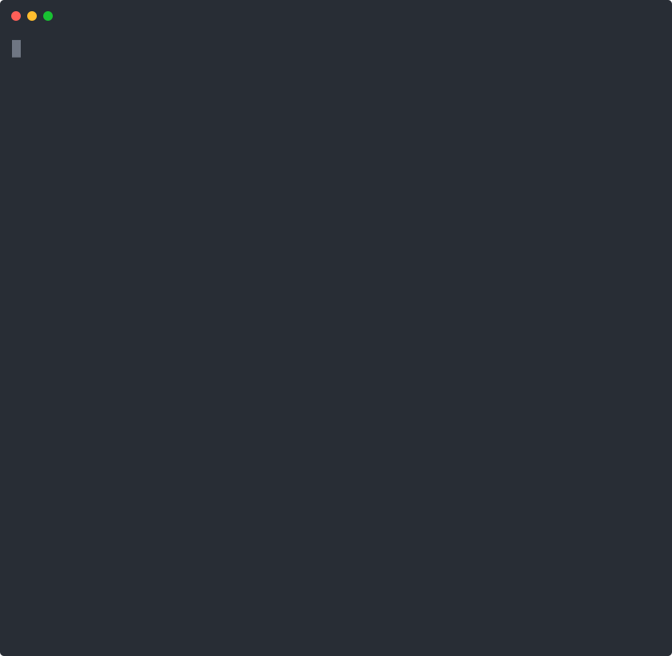

# orbit-ai

> One command to launch any AI coding assistant — Claude Code, OpenAI Codex, Ollama

**orbit** is a universal AI coding assistant launcher for developers who use multiple AI tools. Instead of remembering different commands, managing multiple accounts, and setting environment variables — just type `orbit`.


---



---

## Features

- **Multi-account Claude Code** — switch between work, personal, and client accounts without re-logging in
- **Multi-account OpenAI Codex** — the same for Codex, each account with its own ChatGPT login
- **Ollama** — run local AI models with no internet required
- **Global memory** — one `~/.orbit/memory.md` file injected into every assistant on every launch
- **Setup wizard** — guided first-run experience, detects what's installed and offers to install what's missing
- **Shared sessions** — project conversations are shared across all your Claude accounts
- **Cross-platform** — works on macOS, Linux, and Windows (WSL/Git Bash)

---

## Install

```bash
npm install -g orbit-ai
```

> Requires Node.js 18+

---

## Quick Start

Run `orbit` for the first time and the setup wizard will guide you through everything:

```bash
orbit
```

The wizard will:
1. Ask which AI tools you use
2. Check if they're installed (and offer to install them)
3. Add your first account for each one
4. Show you the welcome screen

---

## Usage

```bash
orbit                    # Launch the assistant selector
orbit --add              # Add a Claude Code or OpenAI Codex account
orbit --remove           # Remove an account
orbit --add-model        # Add an Ollama model to the list
orbit --memory           # Edit global memory in $EDITOR
orbit --memory --show    # Print current memory
orbit --setup            # Re-run the setup wizard
orbit --list             # List all accounts & models
orbit --version          # Show version and detected providers
orbit --help             # Show the welcome screen
```

---

## Supported Providers

| Provider | Description | Install |
|---|---|---|
| [Claude Code](https://claude.ai/code) | Anthropic's AI pair programmer | `npm install -g @anthropic-ai/claude-code` |
| [OpenAI Codex](https://github.com/openai/codex) | OpenAI's terminal coding agent | `npm install -g @openai/codex` |
| [Ollama](https://ollama.com) | Local AI models, no internet required | [ollama.com](https://ollama.com) |

You don't need all three — orbit works with whichever ones you have installed.

---

## Multiple Accounts

If you work across multiple clients or projects, orbit lets you maintain separate accounts — for both Claude Code and OpenAI Codex — with isolated configurations:

```bash
orbit --add
# Which assistant is this account for? Claude Code
# Account name: work
# Email: you@work.com

orbit --add
# Which assistant is this account for? OpenAI Codex
# Account name: personal
# Email: you@gmail.com
```

Each account has its own credentials, and orbit runs `claude login` / `codex login` for it the first time you select it. Claude project conversations are shared across Claude accounts so you never lose context when switching.

Isolation is per provider:
- Claude accounts get their own `CLAUDE_CONFIG_DIR`
- Codex accounts get their own `CODEX_HOME`

---

## Ollama (Local Models)

Select any locally available Ollama model from the launcher. orbit uses Claude Code as the frontend for Ollama, so the experience is identical.

```bash
orbit --add-model
# Model name: llama3:8b
```

---

## Global Memory

orbit can inject a shared rules/context file into every AI assistant on every launch — so you never have to re-explain your workflow, preferences, or project context.

```bash
orbit --memory        # create or edit ~/.orbit/memory.md
orbit --memory --show # view current memory
```

A sample is provided in [`memory.example.md`](memory.example.md). Copy it to get started:

```bash
cp $(npm root -g)/orbit-ai/memory.example.md ~/.orbit/memory.md
orbit --memory   # then customise it
```

`~/.orbit/memory.md` is yours — it never gets committed or shared.

**How it works:**
- Claude / Ollama → written to `$CLAUDE_CONFIG_DIR/CLAUDE.md` at launch
- Codex → written to `$CODEX_HOME/AGENTS.md` at launch
- Account-specific additions → put them in `CLAUDE.local.md` / `AGENTS.local.md` in the same directory

---

## Data

All configuration is stored in `~/.orbit/`:

```
~/.orbit/
├── accounts.json       # Account registry (Claude + Codex)
├── config.json         # Setup state and enabled providers
├── ollama-models.json  # Ollama model list
├── memory.md           # Your global memory (personal, never committed)
├── accounts/           # Per-account Claude config dirs
├── codex-accounts/     # Per-account Codex home dirs
└── projects/           # Shared project sessions
```

No credentials are stored in the package — everything stays on your machine.

---

## Contributing

PRs and issues welcome at [github.com/gourish7/orbit-ai](https://github.com/gourish7/orbit-ai).

---

## License

MIT © [Gourishankar R Pujar](https://github.com/gourish7)
